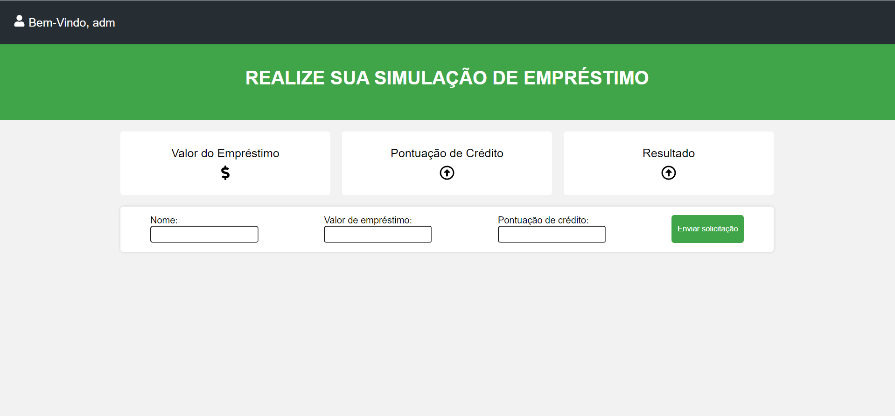

<h1 align="center"><b>Hackaton Questrade 2023</b></h1>
<h1 align="center"></h1>
<h1 >📚  Sobre</h1>
Projeto desenvolvido durante o Hackaton Questrade 2023 junto com Caio Costa (https://github.com/CaioCosta182).

<h1 >🚀  Tecnologias utilizadas</h1>
✔️ ReactJS  
✔️ CSS3  
✔️ Javascript  
✔️ JSX  

---

<h1> 📝 Licença </h1> 

- Esse projeto está sob a licença MIT. 
---

---
<h1> ✒️ Autores </h1> 

Para o desenvolvimento da plataforma temos como:

Ludmila Silva

  
   

Caio César 

  
   

---

---
Copyright (c) 2023  
Feito com ♥ by @CaioCosta e  @LuSilva :wave:
